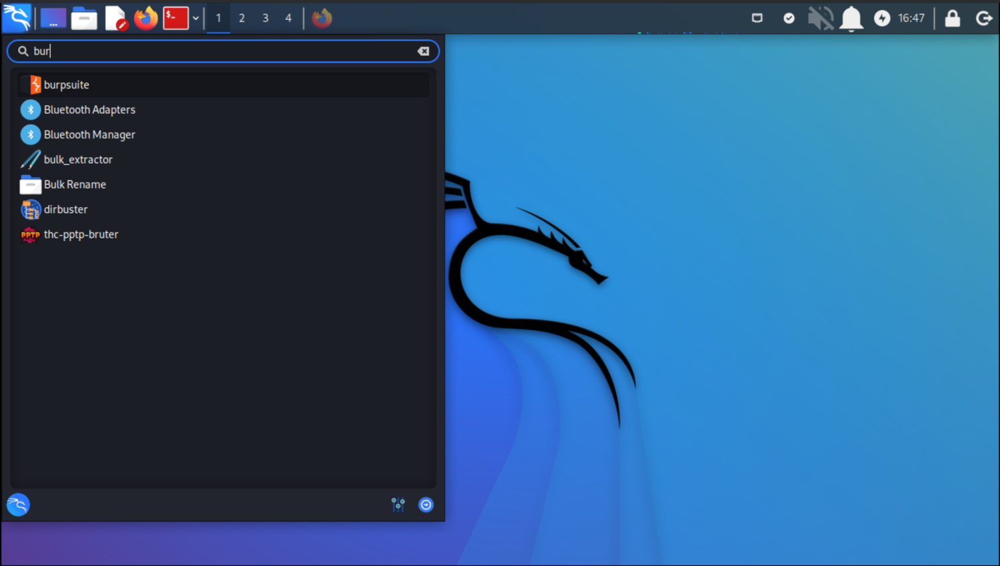
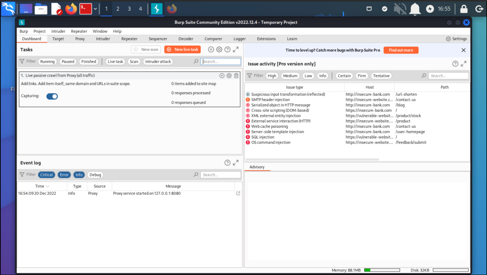

# Setting up Burp Suite on Kali

Burp Suite captures all the traffic from the targeted web application so we can analyse them later. As a penetration tester, you can manipulate this process on your own and analyse the potential risks.

|  |
|:--:|
| Just click and click |

|  |
|:--:|
| Accept, and accept defaults |

And that's it. [The documentation is excellent](https://portswigger.net/burp/documentation/desktop).
