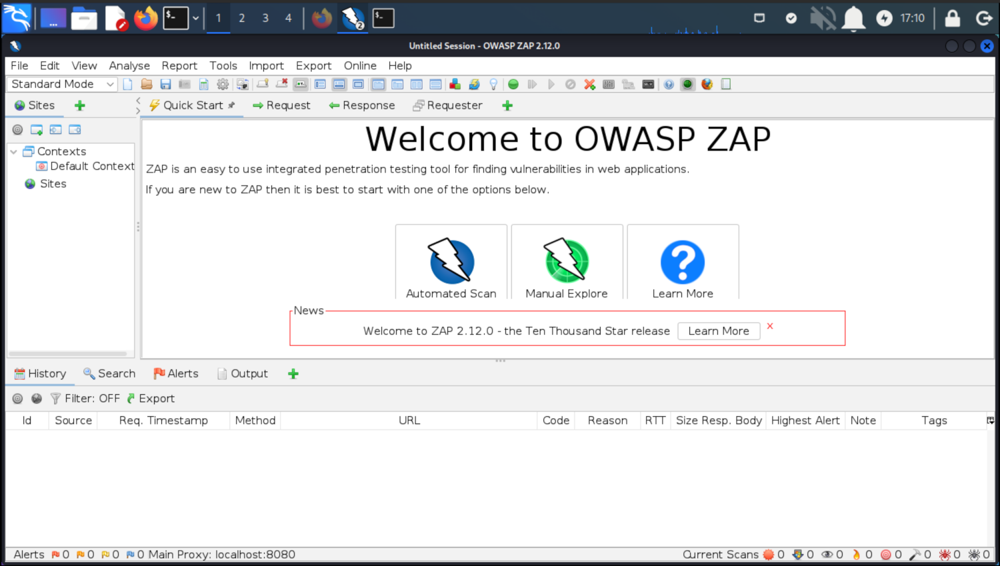

# Setting up ZAP on Kali

OWASP ZAP was not preinstalled on my QEMU KALI VM.

## Installing Zap on Kali

    sudo apt install zaproxy

|  |
|:--:|
| Just click and click |

## Usage Zap

* Open the application through the terminal or by clicking on the icon
* Yes, persist the session
* Enter target web address in the green highlighted box and click attack
* Wait few minutes and analyse results

And [the documentation is good](https://www.zaproxy.org/docs/).