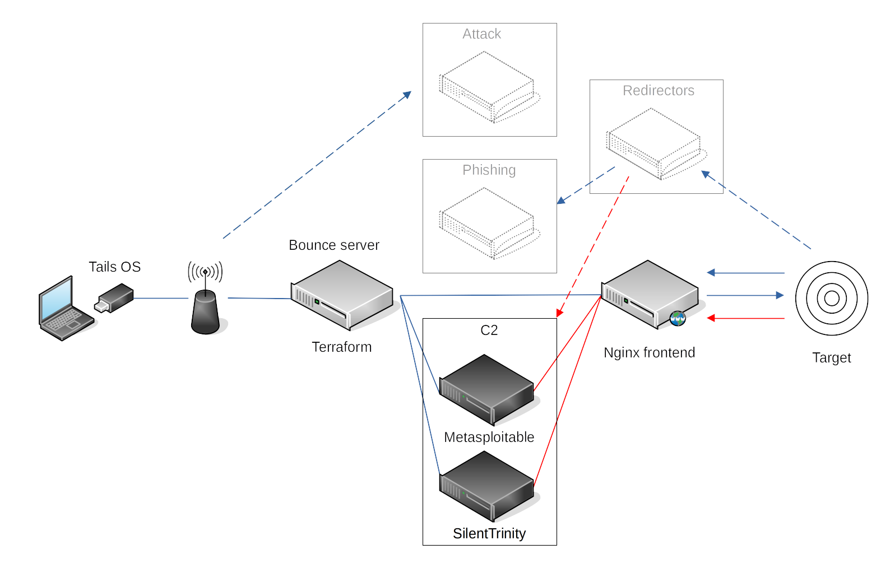

A foothold in the cloud
=========================================================

Red teamers assess the detection maturity of a company by performing real-world attacks. In theory, without scope.
"Ouiet! Loose data can cost lives!"

.. toctree::
   :glob:
   :maxdepth: 1
   :includehidden:
   :caption: Redirectors

   docs/redirectors/README.md

.. toctree::
   :glob:
   :maxdepth: 1
   :includehidden:
   :caption: Attack machines

   docs/attack/README.md
   docs/attack/vpn.md
   docs/attack/location.md
   docs/attack/adapters.md
   docs/attack/ephemeral.md
   docs/attack/server.md

.. toctree::
   :glob:
   :maxdepth: 1
   :includehidden:
   :caption: Bounce servers

   docs/bouncers/README.md
   docs/bouncers/payments.md
   docs/bouncers/major-providers.md
   docs/bouncers/alt-providers.md

.. toctree::
   :glob:
   :maxdepth: 1
   :includehidden:
   :caption: Frontend

   docs/frontend/README.md
   docs/frontend/nginx.md
   docs/frontend/masquerading.md

.. toctree::
   :glob:
   :maxdepth: 1
   :includehidden:
   :caption: Backends

   docs/backends/README.md
   docs/backends/metasploit.md
   docs/backends/silenttrinity.md

.. toctree::
   :glob:
   :maxdepth: 1
   :includehidden:
   :caption: Automation

   docs/automation/README.md
   docs/automation/containers.md
   docs/automation/terraform.md
   docs/automation/aws.md

.. toctree::
   :caption: Links

   Red Team <https://tymyrddin.github.io/red/>